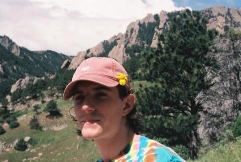
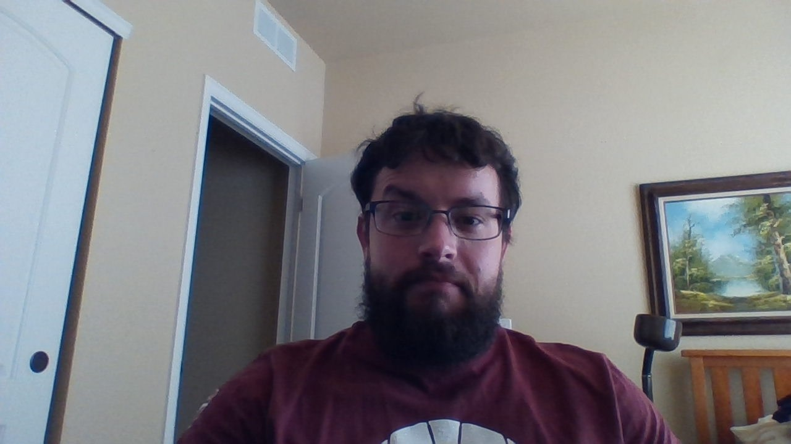
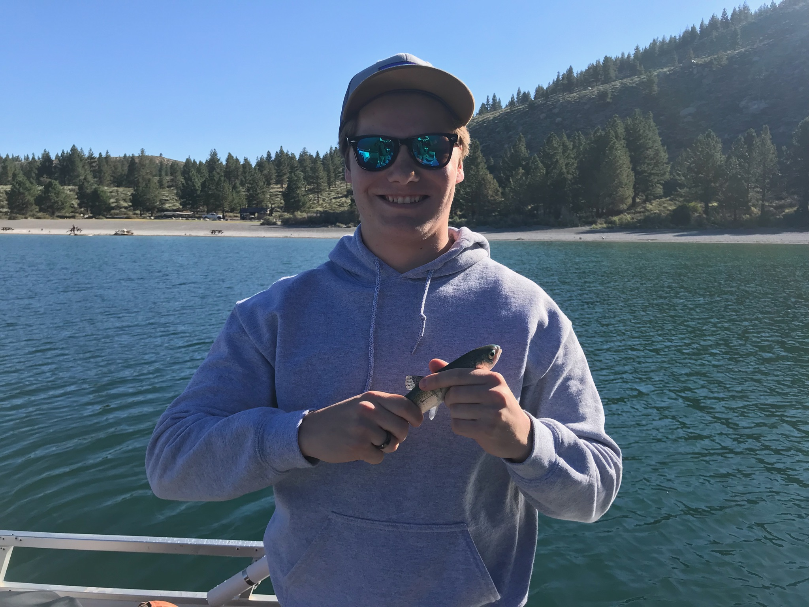

### Team Name

Pick a Team Name 

<!---->

Team Goal(s):

### About Charles:

 
-	At least one (non-statistics) question you would like to know the answer to that could be answered by analyzing data
o	I would like to know the most effective methods of educative retention and learning (e.g. how to study best, how to communicate between students and teachers best, etc.)
-	What you would love to be doing six months after graduation and then five years after that (what would make you excited to be doing?)
o	What I would love to be doing 6 months after graduation would be to study under some of the greatest voices in philosophy (one of my majors) while working towards some meaningful contribution within my fields of interest. 5 years after graduation I would love to be building myself into a great thinker and writer, challenging and being challenged by some of the brightest minds in history.
-	What you hope your greatest career accomplishment will be
o	I hope my greatest career accomplishment will be to have pushed forward meaningful and pressing models for new and old questions in metaphysics. I would like to have learned as much as possible from the brightest people possible over my career. I believe I would be especially happy to become a person who it would be meaningful to learn from.
-	…and given these hopes and goals, what you are hoping to learn/accomplish/do in this course
o	I am interested in statistics and probability insofar as they relate to metaphysics. In enriching myself as a statistician and mathematician I develop necessary perspectives to succeed in my goals.
-	You must also include something of your own choosing not described above. Anything. Be creative!
o	Something I am very proud of is the effort that I am taking to improve myself not only as a student but also as an athlete. I am currently in my third year of rowing for Colorado Crew and I have fallen in love with the sport and the community of my team.

##### Feedback

* Andrew:

* Brian:

* Clint: 

### About Brian:

{width=400px}

* I enjoy lifting weights, and I usually record some data on attempted weights/repetitions, as well as my body weight. It would be interesting to know what conclusions could be drawn about the relative effectiveness of exercise routines in regards to various variables, such as weight loss/gain or maximum weights/repetitions.

* Six months after graduation I would like to be working in either a data related field, or in web development in whatever capacity I can find. If not, I'd like to at least have specific insights into what additional skills I need to acquire for such positions.

* 5 years after that, I'd like to have found whatever particular niche within my field of employment appeals to me the most. Ideally I would be working within that specialization after 5 years, but if not, I hope to at least have a handle on what the specialization is, and a path on how to get there.

* For a greatest accomplishment, I would be satisfied with creating some tool/idea/etc. which people are able to find useful in some relevant capacity. Doing something beyond just making myself/company some profit.

* In this course, I hope to gain some insight into the processes behind performing data science, as well as continuing to work on improving my effectiveness at collaboration. Few people work alone, and so improving one's ability to work within a team is always a useful experience.

* My favorite type of food is Thai food, either curry or noodles. I like food spicy enough to suffer a little bit, but not so spicy to the point where you can't taste anything else.

##### Feedback

* Andrew: Your section gives some good insights into where you come from, and what you enjoy. Since I don't want to critique your (incorrect) choice of NBA team, I will say your section on goals for this course could use a bit more specifics on what exactly you'd like to get from the course.

* Charles: Your section gives some descriptive insights into what drives you as a person. I look forward to working with someone who comes into the group from a different perspective/angle than myself, who is more focused on the math/programming side of things. My primary critique is that your section was uploaded as a seperate file to the main markdown file and so needed to be copied over/formatted a bit.

* Clint: 

### About Andrew 

- Back home in California I enjoy surfing during the summer, but somedays the water is so cold I have to where a wet-suit in the water. Since I'm poor and can't buy another wet-suit, I can't surf! I would like to know what is the ideal time of the year I can go surfing is without a wet-suit?

- Six months after I graduate, I hope to find a job back home in California or attending graduate school for my masters in Data Science. Five years after graduation, I hope to be using Data Science as a way for doctors to better diagonsis and treat their patients.

- I hope my greatest accomplistment is helping a cancer patient better treat their illness through Datas Science and possibily save their life.

- I hope that through this course, I will become a better data scientist and programmer. 

- I'm also a huge Lakers fan and will be praying that my team *cough* Lebron ( who I quite disklike ) will be winning that trophy this year.

##### Feedback

* Brian:

* Charles: 

* Clint: 

